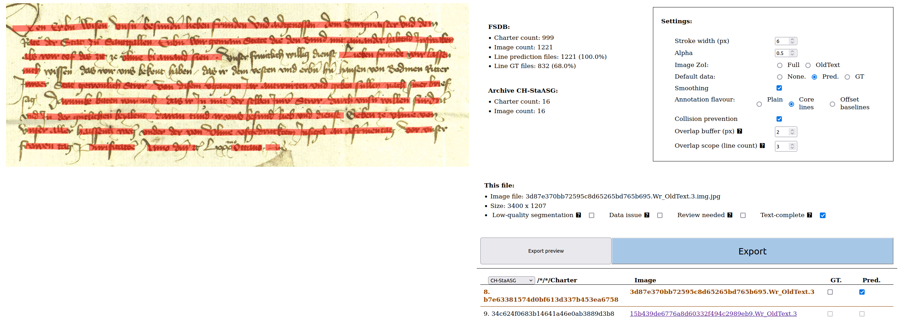
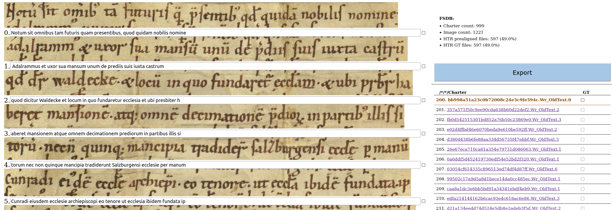

# GT Alignment toolchain

## 1. Charter line annotation tool


A JS+Flask GUI for annotating charters, either for line segmentation or HTR ground-truthing.

### 1.1 Startup

#### Option 1. On top of an FSDB deep tree
```bash
FLASK_fsdb_root='/home/nicolas/fsdb' flask --app charter_annotation run -p 5001
```

By default, the entire charter image is used, with the regions read from the initial line segmentation file (or an image-wide region if no such file is provided). In order to restrict the scope to existing `OldText` crops, use the `FLASK_crop=1` at startup. At export time, the resulting annotation file is a crop-wide file.

#### Option 2. Read and write from a flat directory

No FSDB compliance needed: just ensure that filenames use a consistent prefix/suffix pattern.

```bash
FLASK_flat=1 FLASK_fsdb_root='/home/nicolas/fsdb' flask --app charter_annotation run -p 5001
```

### 1.2 Default suffixes


| Data | Workflow | Flask option | Prefix |
|:-----|:---------|:-------------|:-------|
| Line segmentation predictions | line annotation input | `FLASK_pred_seg_suffix` | `lines.pred.json`|
| Line segmentation data GT | line annotation input/output | `FLASK_gt_seg_suffix` | `lines.gt.json`|
| HTR predictions | HTR annotation input | `FLASK_pregt_htr_suffix` | `htr.pregt.json`|
| HTR ground-truth | HTR annotation input/output | `FLASK_gt_htr_suffix` | `htr.gt.json` |

### 1.3 Other options


See `charter_annotation.py` for the following flags:

+ `FLASK_json_validate`: JSON validation
+ `FLASK_schema_path`: JSON schema (default: `static/lines_schema.json`)

### 1.4 Annotation mode

#### Segmentation GT: Create or correct a line segmentation

```
http://localhost:5000/segmentation

```


Limitations: regions can be read and modified or deleted, but they cannot be created from scratch.
They are typically read from an existing segmentation prototype.

#### HTR ground-truth: review/correct a line-based transcription

```
http://localhost:5000
```




## 2. Alignment script

A hack that uses a passable HTR in order to align existing full-paragraph GT transcriptions with an existing segmentation.

### Syntax 

```bash
python3 gt_alignment.py [options]
```

where the options are as follows:

```bash
-appname=<class 'str'>  Default 'gt_alignment' . Passed 'gt_alignment'
-model_path=<class 'str'>  Default '/tmp/default_model.mlmodel' . Passed '/tmp/default_model.mlmodel'
-img_paths=<class 'set'>  Default set() . Passed set()
-heuristics_on=<class 'int'>  Default 1 . Passed 1
-gt_seg_suffix=<class 'str'>  Default 'lines.gt.json' . Passed 'lines.gt.json'
-pregt_htr_suffix=<class 'str'>  Default 'htr.pregt.json' . Passed 'htr.pregt.json'
-tenor_suffix=<class 'str'>  Default 'revised_tenor.txt' . Passed 'revised_tenor.txt'
-help=<class 'bool'> Print help and exit. Default False . Passed False
-bash_autocomplete=<class 'bool'> Print a set of bash commands that enable autocomplete for current program. Default False . Passed False
-h=<class 'bool'> Print help and exit Default False . Passed True
-v=<class 'int'> Set verbosity level. Default 1 . Passed 1
```

### Examples

Aligning GT for explicit image files:


```bash
export PYTHONPATH=/home/nicolas/graz/htr/vre/ddpa_htr; ~/graz/htr/hw_gt_alignment/gt_alignment.py -model_path $PYTHONPATH/models/default.mlmodel -img_paths CH-StaASG/b54cf369ddc02d3d3201184dc49dfb51/b7e63381574d0bf613d337b453ea6758/3d87e370bb72595c8d65265bd765b695.seals.crops/3d87e370bb72595c8d65265bd765b695.Wr_OldText.3.img.jpg
```

Aligning GT for all images that have valid tenor file:

```bash
(for img in $(find . -name "*OldText*.img.jpg"); do 
	test -f "${img%.img.jpg}.revised_tenor.txt" && echo $img ; 
done ) | xargs ~/graz/htr/hw_gt_alignment/gt_alignment.py -model_path $PYTHONPATH/model_save.mlmodel.best -img_paths
```

Resulting `*.htr.gt.json` file can be reviewed and corrected with the line transcription viewer above.

## 3. Running in Docker

Build the container:

```bash
sudo docker image rm ch-lat;  sudo docker build --tag ch-lat .
```

Run:

```bash
sudo docker run -v /tmp/fsdb_full_text_sample_100:/fsdb_root --rm -it --env-file ./env ch-lat
```

